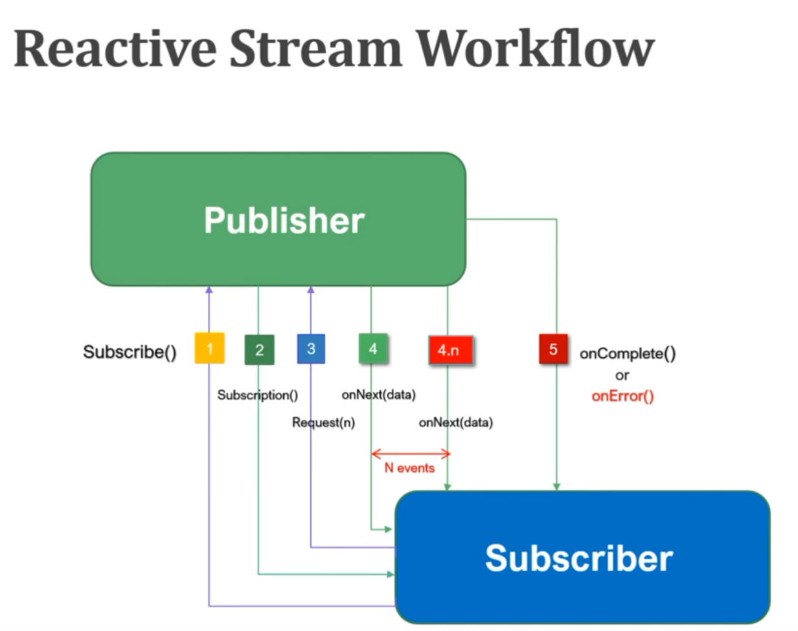

# Reactive Programming

- Publisher: Data Source that always publish an event
- Subscriber or Consumer: Subscribe/consume the events from publisher
- Subscription: Represents the unique relationship between a Subscriber and a Publisher
- Processor: Processing stage where the Subscriber and a Publisher must obey the contracts of both

- Reactive Tests
~~~java
package com.example.reactiveprogramming;

import org.junit.jupiter.api.Test;
import reactor.core.publisher.Flux;
import reactor.core.publisher.Mono;

/**
 * @author Heshan Karunaratne
 */
public class MonoFluxTest {

    @Test
    public void testMono() {
        Mono<String> monoString = Mono.just("abc").log();
        monoString.subscribe(System.out::println);
    }

    @Test
    public void testMonoError() {
        Mono<Object> mono = Mono.just("abc")
                .then(Mono.error(new RuntimeException("Exception!!!")))
                .log();
        mono.subscribe(System.out::println, e -> System.out.println(e));
    }

    @Test
    public void testFlux() {
        Flux<String> fluxString = Flux.just("Spring", "Springboot", "Hibernate", "Microservice")
                .concatWithValues("AWS")
                .log();
        fluxString.subscribe(System.out::println);
    }

    @Test
    public void testFluxError() {
        Flux<String> fluxString = Flux.just("Spring", "Springboot", "Hibernate", "Microservice")
                .concatWithValues("AWS")
                .concatWith(Flux.error(new RuntimeException("Exception!!!")))
                .log();
        fluxString.subscribe(System.out::println, e -> System.out.println(e));
    }
}
~~~