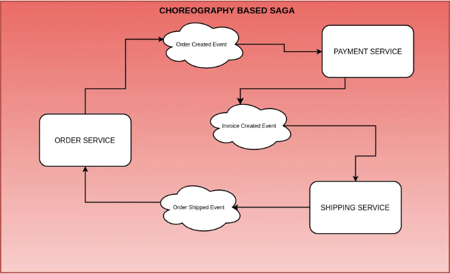
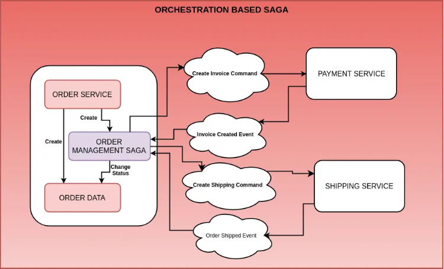

# Saga Pattern

- Saga Pattern proposes implementing distributed transactions in the form of Sagas
- A Saga is nothing but a sequence of local transactions. These local transactions are occurring at the service level. Whenever a local transaction occurs, it publishes a message or an event. Such an event is responsible for triggering the next transaction in the Saga
- If any single transaction fails Saga executes a series of compensating transactions. These transactions basically undo the changes made by the preceding transactions

There are basically two types of Saga
- Choreography-Based Saga

- Order Service is responsible for creating an Order. It also publishes an event for the same
- The Payment Service listens to that event and creates an Invoice
- When the Invoice is created, the Shipping Service creates the shipment
- When the Order is shipped, the Order Service updates the status of the Order
- Each service plays its part in the choreography
- Each service is basically dependent on the events coming out from other services

- Orchestration-Based Saga

- Order Service creates an Order. Then, it also creates the Order Management Saga
- The Order Management Saga sends a Create Invoice Command to the Payment Service
- The Payment Service creates the Invoice and responds back to the Order Management Saga. Note that these responses can be totally asynchronous and message-driven as well
- In the next step, the Order Management Saga issues the Create Shipping Command to the Shipping Service
- The Shipping Service does the needful and creates the Shipping. It also replies back to the Order Management Saga
- The Order Management Saga changes the status of the Order and ends the Saga’s life-cycle

- 5 Major High Level Components
    - Order Service: 
        1. Exposes APIs to create an Order
        2. Manages the Order Aggregate(Maintains order related information)
        3. Handles Order Management Saga implementation
    - Payment Service:
        1. Acts upon the 'CreateInvoiceCommand' issued by the Order Management Saga
        2. After completing publishes an 'InvoiceCreatedEvent' event
    - Shipping Service:
        1. Acts upon the 'CreateShippingCommand' issued by the Order Management Saga
        2. After completing publishes an 'OrderShippedEvent' event
    - Core-APIs:
        1. Acts as the integration-glue between various services that form a part of the Saga 
        2. Consist of the various commands and event definitions required for our Saga implementation to function
    - Axon Server:
        1. Axon Server is part of the Axon Platform
        2. We will be using Axon Framework to manage our Aggregates such as Order, Payment, Shipping
        3. Handle the communication between the three services
        
~~~text
@Aggregate
public class OrderAggregate {

    @AggregateIdentifier
    private String orderId;
    private ItemType itemType;
    private BigDecimal price;
    private String currency;
    private OrderStatus orderStatus;

    public OrderAggregate() {
    }

    @CommandHandler
    public OrderAggregate(CreateOrderCommand createOrderCommand){
        AggregateLifecycle.apply(new OrderCreatedEvent(createOrderCommand.orderId, createOrderCommand.itemType,
                createOrderCommand.price, createOrderCommand.currency, createOrderCommand.orderStatus));
    }

    @EventSourcingHandler
    protected void on(OrderCreatedEvent orderCreatedEvent){
        this.orderId = orderCreatedEvent.orderId;
        this.itemType = ItemType.valueOf(orderCreatedEvent.itemType);
        this.price = orderCreatedEvent.price;
        this.currency = orderCreatedEvent.currency;
        this.orderStatus = OrderStatus.valueOf(orderCreatedEvent.orderStatus);
    }

    @CommandHandler
    protected void on(UpdateOrderStatusCommand updateOrderStatusCommand){
        AggregateLifecycle.apply(new OrderUpdatedEvent(updateOrderStatusCommand.orderId, updateOrderStatusCommand.orderStatus));
    }

    @EventSourcingHandler
    protected void on(OrderUpdatedEvent orderUpdatedEvent){
        this.orderId = orderId;
        this.orderStatus = OrderStatus.valueOf(orderUpdatedEvent.orderStatus);
    }
}
~~~

- @Aggregate and @AggregateIdentifier are axon specific annotations and this will allow Axon Framework to manage the Order Aggregate instances
- @CommandHandler takes a command and always calls the AggregateLifecycle.apply() and creates a new instance of the event
- @EventSourcingHandler always takes the event and updates entity values

~~~text
public interface OrderCommandService {
    public CompletableFuture<String> createOrder(OrderCreateDTO orderCreateDTO);
}

@Service
public class OrderCommandServiceImpl implements OrderCommandService {

    private final CommandGateway commandGateway;

    public OrderCommandServiceImpl(CommandGateway commandGateway) {
        this.commandGateway = commandGateway;
    }

    @Override
    public CompletableFuture<String> createOrder(OrderCreateDTO orderCreateDTO) {
        return commandGateway.send(new CreateOrderCommand(UUID.randomUUID().toString(), orderCreateDTO.getItemType(),
                orderCreateDTO.getPrice(), orderCreateDTO.getCurrency(), String.valueOf(OrderStatus.CREATED)));
    }
}
~~~

- This service implementation uses Axon Framework’s Command Gateway to issue a command to the Aggregate

~~~text
@RestController
@RequestMapping(value = "/api/orders")
@Api(value = "Order Commands", description = "Order Commands Related Endpoints", tags = "Order Commands")
public class OrderCommandController {

    private OrderCommandService orderCommandService;

    public OrderCommandController(OrderCommandService orderCommandService) {
        this.orderCommandService = orderCommandService;
    }

    @PostMapping
    public CompletableFuture<String> createOrder(@RequestBody OrderCreateDTO orderCreateDTO){
        return orderCommandService.createOrder(orderCreateDTO);
    }
}
~~~

- The heart of the Saga Pattern implementation is the Order Management Saga

~~~text
@Saga
public class OrderManagementSaga {

    @Inject
    private transient CommandGateway commandGateway;

    @StartSaga
    @SagaEventHandler(associationProperty = "orderId")
    public void handle(OrderCreatedEvent orderCreatedEvent){
        String paymentId = UUID.randomUUID().toString();
        System.out.println("Saga invoked");

        //associate Saga
        SagaLifecycle.associateWith("paymentId", paymentId);

        System.out.println("order id" + orderCreatedEvent.orderId);

        //send the commands
        commandGateway.send(new CreateInvoiceCommand(paymentId, orderCreatedEvent.orderId));
    }

    @SagaEventHandler(associationProperty = "paymentId")
    public void handle(InvoiceCreatedEvent invoiceCreatedEvent){
        String shippingId = UUID.randomUUID().toString();

        System.out.println("Saga continued");

        //associate Saga with shipping
        SagaLifecycle.associateWith("shipping", shippingId);

        //send the create shipping command
        commandGateway.send(new CreateShippingCommand(shippingId, invoiceCreatedEvent.orderId, invoiceCreatedEvent.paymentId));
    }

    @SagaEventHandler(associationProperty = "orderId")
    public void handle(OrderShippedEvent orderShippedEvent){
        commandGateway.send(new UpdateOrderStatusCommand(orderShippedEvent.orderId, String.valueOf(OrderStatus.SHIPPED)));
    }

    @SagaEventHandler(associationProperty = "orderId")
    public void handle(OrderUpdatedEvent orderUpdatedEvent){
        SagaLifecycle.end();
    }
}
~~~

- For every command need to specify @TargetAggregateIdentifier to identify as a unique value

~~~text
OrderCommandController(@RestController, @RequestBody OrderRestModel)
|
CreateOrderCommand
|
|-> OrderAggregate(@CommandHandler/OrderAggregate(CreateOrderCommand createOrderCommand), @EventSourcingHandler/on(OrderCreatedEvent event))
|-> OrderEventsHandler(@EventHandler/on(OrderCreatedEvent event))
|-> OrderProcessingSaga(@StartSaga, @SagaEventHandler(associationProperty = "orderId")/handle(OrderCreatedEvent event))
|
|->-> cancelOrderCommand(String orderId)
|->-> OrderAggregate(@CommandHandler/handle(CancelOrderCommand cancelOrderCommand), @EventSourcingHandler/on(OrderCancelledEvent event))
|->-> OrderEventsHandler(@EventHandler/on(OrderCancelledEvent event))
|->-> OrderProcessingSaga(@EndSaga, @SagaEventHandler(associationProperty = "orderId")/handle(OrderCancelledEvent event))
|
ValidatePaymentCommand
|
|-> PaymentAggregate(@CommandHandler/PaymentAggregate(ValidatePaymentCommand validatePaymentCommand), @EventSourcingHandler/on(PaymentProcessedEvent event))
|-> PaymentsEventsHandler(@EventHandler/on(PaymentProcessedEvent event))
|-> OrderProcessingSage(@SagaEventHandler(associationProperty = "orderId")/handle(PaymentProcessedEvent event))
|
|->-> cancelPaymentCommand(PaymentProcessedEvent event)
|->-> PaymentAggregate(@CommandHandler/handle(CancelPaymentCommand cancelPaymentCommand), @EventSourcingHandler/on(PaymentCancelledEvent event))
|->-> PaymentsEventsHandler(@EventHandler/on(PaymentCancelledEvent event))
|->-> OrderProcessingSage(@SagaEventHandler(associationProperty = "orderId")/handle(PaymentCancelledEvent event)) -> cancelOrderCommand(event.getOrderId())
|
ShipOrderCommand
|
|-> ShipmentAggregate(@CommandHandler/ShipmentAggregate(ShipOrderCommand shipOrderCommand), @EventSourcingHandler/on(OrderShippedEvent event))
|-> ShipmentEventsHandler(@EventHandler/on(OrderShippedEvent event))
|-> OrderProcessingSage(@SagaEventHandler(associationProperty = "orderId")/handle(OrderShippedEvent event))
|
CompleteOrderCommand
|
|-> OrderAggregate(@CommandHandler/handle(CompleteOrderCommand completeOrderCommand), @EventSourcingHandler/on(OrderCompletedEvent event))
|-> OrderEventsHandler(@EventHandler/on(OrderCompletedEvent event))
|-> OrderProcessingSaga(@EndSaga, @SagaEventHandler(associationProperty = "orderId")/handle(OrderCompletedEvent event))
~~~